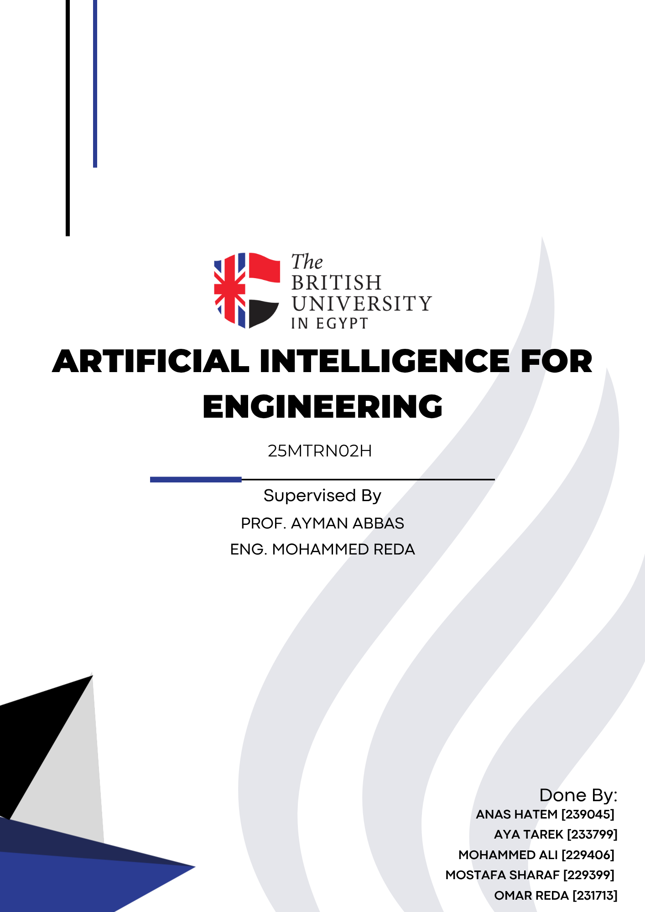

# VOID — Local Aerospace Engineering Chatbot

VOID is a desktop AI assistant for aerospace engineering that runs entirely on your own
machine. It pairs a locally-run LLaMA-3-8B model (through llama.cpp) with a retrieval layer
over an aerospace knowledge base, so answers are grounded in a fixed set of notes rather than
whatever the base model happened to memorise. The whole thing sits behind a custom PyQt6
interface. Nothing is sent to a cloud API.

The point of the project was to build a complete retrieval-augmented-generation (RAG) system
end to end — embeddings, a vector store, a fine-tuned local model, and the prompt logic that
ties them together — instead of calling a hosted model.



## What it does

You ask it an aerospace question. Before the model answers, VOID searches a vector database
of aerospace notes for the couple of most relevant entries and pastes them into the prompt as
context, along with the recent chat history. A strict system prompt keeps the model on topic
(it refuses non-aerospace questions) and tells it to answer only from the retrieved notes and
say so when it doesn't have the information, which cuts down on invented answers.

## How it works

```
CSV knowledge base ──▶ BGE embeddings ──▶ Chroma vector DB (persisted on disk)
                                              │
user question ──▶ retrieve top-k relevant notes
                                              │
          build prompt: system rules + retrieved notes + recent history + question
                                              │
                       LLaMA-3-8B (llama.cpp) + LoRA adapter
                                              │
                        clean up the reply ──▶ chat UI
```

- **Retrieval.** The aerospace dataset (a CSV) is embedded with the `BAAI/bge-small-en-v1.5`
  model and stored in a persistent Chroma database. On startup VOID loads the existing
  database if it's already built, and only re-embeds the CSV from scratch if it isn't, so
  normal launches are fast.
- **Local model.** The language model is a quantised LLaMA-3-8B (`Q4_K_M` GGUF) run through
  `llama-cpp-python` with GPU offload, loaded together with a LoRA adapter — a fine-tune I
  trained and apply on top of the base weights at load time.
- **Grounded, on-topic prompting.** Each query retrieves the top two matching notes; the
  prompt instructs the model to stay strictly within aerospace, answer only from those notes,
  and admit when the answer isn't in them. The retrieved context and the last few turns of the
  conversation are both included so follow-up questions work.
- **Inference off the UI thread.** Generation runs in a `QThread` worker so the interface
  stays responsive, with a "thinking" indicator while the model works and a typewriter effect
  that renders the reply as Markdown as it streams in.
- **Response cleanup.** Local models like to prefix their answers with headers like
  "VOID:" or "Response:"; a cleanup pass strips those so the chat reads naturally.

## The interface

The GUI is hand-built in PyQt6, not a web view. It has a local login (passwords are SHA-256
hashed into a small spreadsheet), per-user chat history saved to JSON, a light/dark theme,
an animated parallax starfield background and a "breathing" orb, and Markdown-rendered chat
bubbles. `rag_demo.py` is a smaller standalone script that shows the same RAG idea on its
own, using an OpenAI-compatible local server (LM Studio) as the model backend instead of
llama.cpp — useful for testing the retrieval logic without loading the full model.

## Running it

```
pip install -r requirements.txt
python void_app.py
```

The model weights and the vector database are not included in this repo (they're large):

- Download a LLaMA-3-8B GGUF (`Q4_K_M`) and place it next to `void_app.py`, matching the
  `model_path` in the file.
- Provide the LoRA adapter as `my_lora_adapter.gguf` (or edit `lora_path`).
- Put the aerospace CSV next to the script; on first run VOID builds the Chroma database from
  it automatically.

A CUDA GPU is assumed for both the embeddings and the model; the paths for the device can be
changed to CPU in the code if needed.

## Repository layout

```
void_app.py        the full application: RAG backend + PyQt6 GUI
rag_demo.py        standalone RAG demo against a local OpenAI-compatible server
requirements.txt   Python dependencies (inferred from imports; unpinned)
media/             cover image
```

## Credits

The retrieval stack uses LangChain, Chroma, and the `BAAI/bge-small-en-v1.5` embedding model;
inference uses llama.cpp (via `llama-cpp-python`) with a LLaMA-3-8B base model. The
application code, the fine-tune, the prompt design and the interface are mine.
